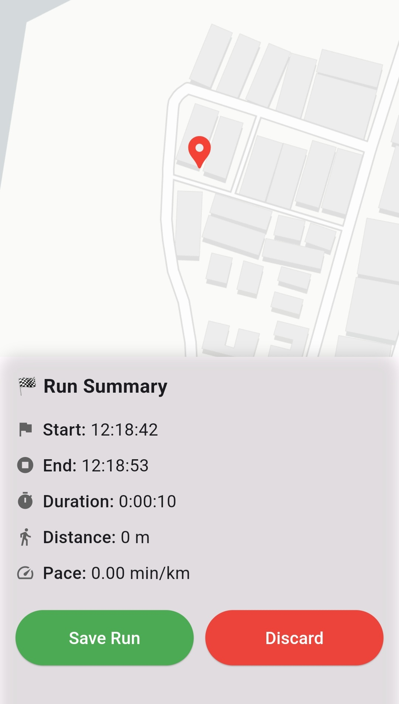
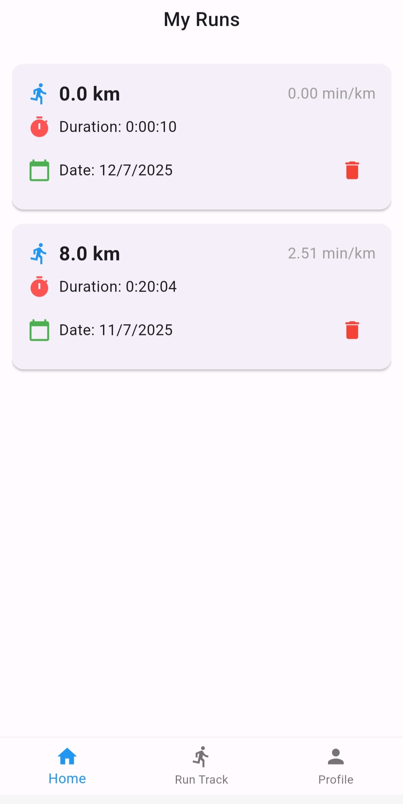
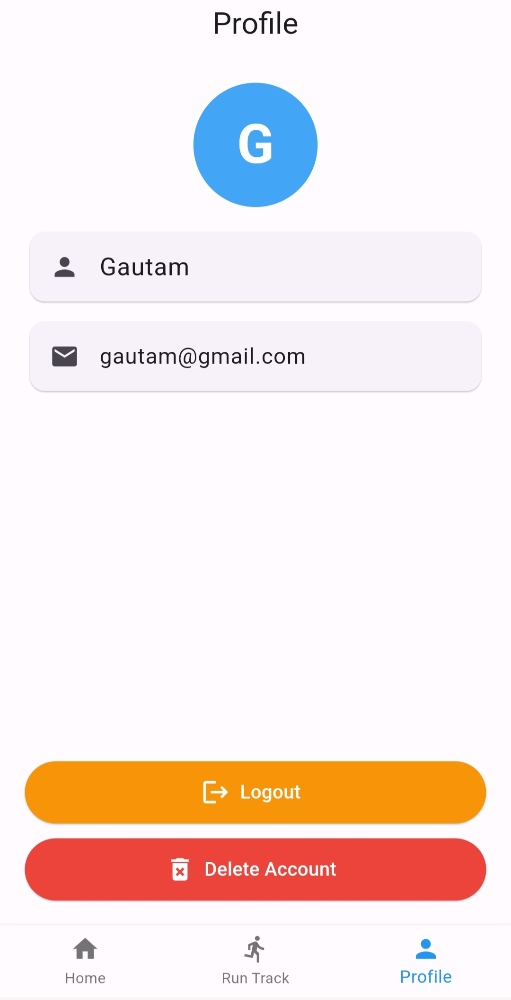

# 🏃‍♂️ Runn-Tracker (Flutter App)

**Runn-Tracker** is a Flutter-based mobile app designed to help users track their running sessions in real time using GPS. It connects to a Spring Boot backend hosted on Render and offers features like tracking, run history, and account management.

---

## 🚀 Features

- 📍 Track your run using GPS (with live route)
- 🕒 View past run history (distance, time, pace)
- 🗑️ Delete individual runs
- 🔐 User authentication (via backend)
- 🚪 Logout and delete account
- 🔄 Run tracking continues even when screen is off

---

## 📦 Dependencies

```yaml
dependencies:
  flutter:
    sdk: flutter
  provider: ^6.1.5
  flutter_map: ^6.x.x
  geolocator: ^9.x.x
  shared_preferences: ^2.x.x
  flutter_local_notifications: ^x.x.x
```

> ✏️ Replace `x.x.x` with your actual version numbers if needed.

---

## 🔧 Setup Instructions

### 1. Clone the Repo

```bash
git clone https://github.com/gautamrawat543/Runn-Tracker-Frontend.git
cd runn-tracker
```

### 2. Install Packages

```bash
flutter pub get
```

### 3. Configure Backend URL

Update your API URL in the lib/api/ files(point it to your Spring Boot Render API).

### 4. Run the App

```bash
flutter run
```

---

## 📂 Project Structure

```bash
lib/
├── api/                  # API calls
├── models/               # Data models
├── pages/                # UI screens
├── provider/             # State management (Provider)
├── styles/               # Reusable style definitions
└── main.dart             # App entry point
```

---

## 🧠 State Management

The app uses **Provider** for managing global state such as run session info, user authentication, and history updates.

---

## 🌐 Backend Integration

The app is connected to a **Spring Boot backend** hosted on **Render.com**, which handles:

- User registration and login (JWT-based auth)
- Saving and fetching run data
- Deleting user and runs securely

---

## 📱 Screenshots

```
### 🏁 Live Run Tracker



### 📊 Run History



### 👤 Profile & Settings


```

---

## 👨‍💻 Author

**Gautam Rawat**  
GitHub: [@gautamrawat543](https://github.com/gautamrawat543)
